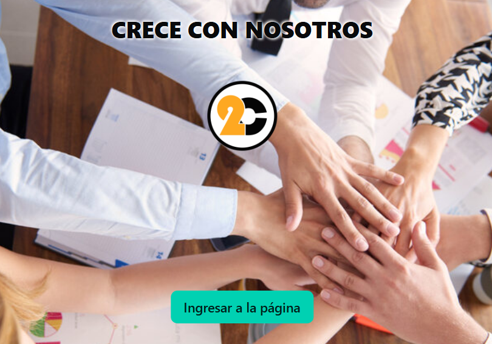
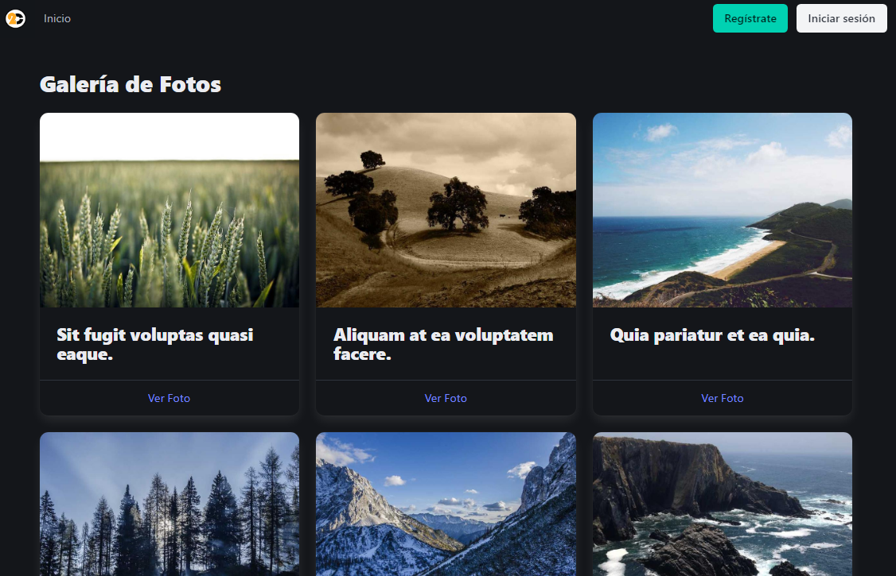

<h1 align="center">Hi, I'm <a href="https://www.linkedin.com/in/carloscardenasbravo/">Carlos</a> 👋</h1>

## About Me

- ⭐ I'm Carlos Cárdenas Bravo ⭐ 
- ⭐ I live in Santiago, Chile
- ⭐ I work as a Construction Site Manager and develop applications in Ruby on Rails
- ⭐ I am a Civil Constructor from Federico Santa María University
- ⭐ I completed a WordPress course
- ⭐ I am finishing the Ruby on Rails Bootcamp
- ⭐ I am currently pursuing a diploma in Digital Business Growth and Personal Branding
- ⭐ I am starting a Flutter course
- ⭐ My programming experience includes frontend development with WordPress, HTML, and CSS, and currently, I am developing apps in Rails and Flutter.

 

## <picture>  </picture> Contact Me

	
	
	
	
	
	

## Completed Projects
<table>
<tr>
<td width="50%">
<h3 align="center">Job Application App</h3>

Esteban is looking for an internal platform for his company. Specifically, he wants his employees to be able to apply for internal positions within the company to improve their salaries and advance their careers. For this reason, the client has contacted us to develop such a platform.

                                                                                      
</td>

<td width="50%">
                
<h3 align="center">Photographer Portfolio</h3>

                                       

 

Karina is a world-renowned photographer. However, she does not have a platform to showcase her work. Although Instagram serves her well, she is looking for something more professional to maintain control over her work and upload content freely without restrictions.

                                                             
</table>                                                                                 

 

  
</table>                                                                                 

 

### ⚙️ &nbsp;GitHub Analytics

